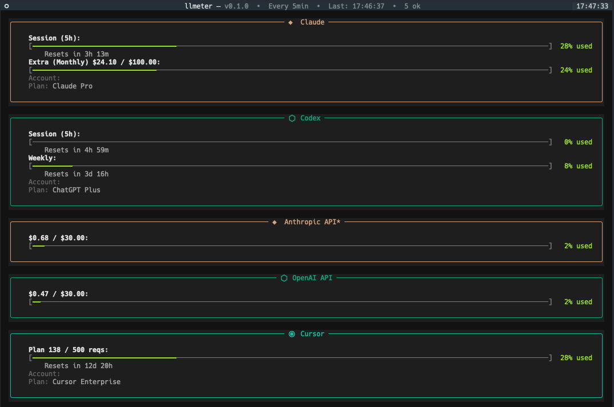

# llmeter

A CLI tool to monitor your LLM subscription and API limits.



## Features

- **Multiple providers** — Codex, Claude, Cursor, GitHub Copilot, and more
- **Self-contained auth** — Login once with OAuth or manually enter cookies/API keys. No external dependencies.
- **Interactive or static** — Color-coded usage bars with reset countdowns, auto-refreshing
- **Config-driven** — JSON config controls which providers are shown and in what order

## Supported Providers

### Subscription-based

| Provider | ID | How it works | Auth |
|----------|----|-------------|------|
| **OpenAI ChatGPT** | `codex` | OAuth | `llmeter --login codex` |
| **Anthropic Claude** | `claude` | OAuth | `llmeter --login claude` |
| **Google Gemini** | `gemini` | OAuth | `llmeter --login gemini` |
| **GitHub Copilot** | `copilot` | OAuth (Device Flow) | `llmeter --login copilot` |
| **Cursor** | `cursor` | Cookie | `llmeter --login cursor` |

### API usage

| Provider | ID | How it works | Auth |
|----------|----|-------------|------|
| **OpenAI API** | `openai-api` | `GET /v1/organization/costs` | Admin API key |
| **Anthropic API** | `anthropic-api` | `GET /v1/organizations/cost_report` | Admin API key |
| **Opencode Zen** | `opencode` | Scrapes workspace page | Auth cookie (see below) |

## Prerequisites

- Python 3.11+

## Install

### For global usage

Install with `uv`:

```bash
# Install
uv tool install git+https://github.com/emmaneugene/llmeter
# Upgrade
uv tool upgrade llmeter
# Uninstall
uv tool uninstall llmeter
```

Or `pipx`:

```bash
# Install
pipx install git+https://github.com/emmaneugene/llmeter
# Upgrade
pipx upgrade llmeter
# Uninstall
pipx uninstall llmeter
```

Or plain pip:

```bash
# Install
pip install git+https://github.com/emmaneugene/llmeter
# Upgrade
pip install --upgrade git+https://github.com/emmaneugene/llmeter
# Uninstall
pip uninstall llmeter
```

### Local development

```bash
uv sync --extra dev
```

## Configuration

Config file: `~/.config/llmeter/settings.json`

Generate a default one:

```bash
llmeter --init-config
```

### Example with all providers

```json
{
  "providers": [
    { "id": "codex" },
    { "id": "claude" },
    { "id": "gemini" },
    { "id": "copilot" },
    { "id": "cursor" },
    { "id": "openai-api", "api_key": "sk-admin-...", "monthly_budget": 50.0 },
    { "id": "anthropic-api", "api_key": "sk-ant-admin01-...", "monthly_budget": 50.0 },
    { "id": "opencode", "api_key": "<auth-cookie>", "monthly_budget": 20.0 }
  ],
  "refresh_interval": 120
}
```

- **`providers`** — Providers to display, in order. Only listed providers are fetched.
- **`refresh_interval`** — Auto-refresh interval in seconds (default: 120).

Provider-specific settings:

| Setting | Applies to | Description |
|---------|-----------|-------------|
| `api_key` | `openai-api`, `anthropic-api`, `opencode` | Admin API key or auth cookie (overrides env var) |
| `monthly_budget` | `openai-api`, `anthropic-api`, `opencode` | Budget in USD — spend shown as a percentage bar |

### Credential storage

All OAuth credentials are stored in a single file:

```
~/.config/llmeter/auth.json
```

Each provider stores its tokens under a provider key (`anthropic`, `openai-codex`, `google-gemini-cli`, `github-copilot`). Tokens are auto-refreshed on each run where applicable. The file is created with `0600` permissions.

### Opencode auth

The `opencode` provider uses an HttpOnly session cookie from opencode.ai rather than an API key. Extract it from DevTools:

1. Open [opencode.ai](https://opencode.ai) in your browser and sign in.
2. Open DevTools → **Application** → **Cookies** → `https://opencode.ai`.
3. Copy the value of the `auth` cookie.
4. Set it in config (`"api_key": "<value>"`) or via the `OPENCODE_AUTH_COOKIE` env var.

### CLI flags

| Flag | Description |
|------|-------------|
| `--snapshot` | Fetch data once and print to stdout (no TUI). |
| `--json` | With `--snapshot`: emit JSON instead of Rich panels. |
| `--refresh SECONDS` | Override auto-refresh interval (60–3600 s). |
| `--login PROVIDER` | Run the interactive login flow for a provider. |
| `--logout PROVIDER` | Remove stored credentials for a provider. |
| `--init-config` | Write a default config file and exit. |
| `--version` | Print version and exit. |

### Environment variables

API keys can also be set via environment variables:

| Variable | Provider | Notes |
|----------|----------|-------|
| `OPENAI_ADMIN_KEY` | `openai-api` | Primary — admin key for costs endpoint |
| `OPENAI_API_KEY` | `openai-api` | Fallback |
| `ANTHROPIC_ADMIN_KEY` | `anthropic-api` | Primary — admin key for cost reports |
| `ANTHROPIC_API_KEY` | `anthropic-api` | Fallback |
| `OPENCODE_AUTH_COOKIE` | `opencode` | Value of the `auth` cookie (see above) |

If no config file exists, `claude` and `codex` are shown by default.

### HTTP debug logging

To inspect provider HTTP request/response metadata without disrupting the TUI, enable file-based debug logging:

```bash
LLMETER_DEBUG_HTTP=1 llmeter
```

Logs are written as JSON lines to:

```
~/.config/llmeter/debug.log
```

Optional custom path:

```bash
LLMETER_DEBUG_HTTP=1 LLMETER_DEBUG_LOG_PATH=/tmp/llmeter-debug.log llmeter
```

Logs include full request metadata (including auth headers/tokens/cookies when present).
The debug log file is written with user-only permissions when possible (`0600`).

## Credits

- **[CodexBar](https://github.com/steipete/CodexBar)** — original inspiration
- **[pi-mono](https://github.com/badlogic/pi-mono)** — referenced for OAuth implementations
