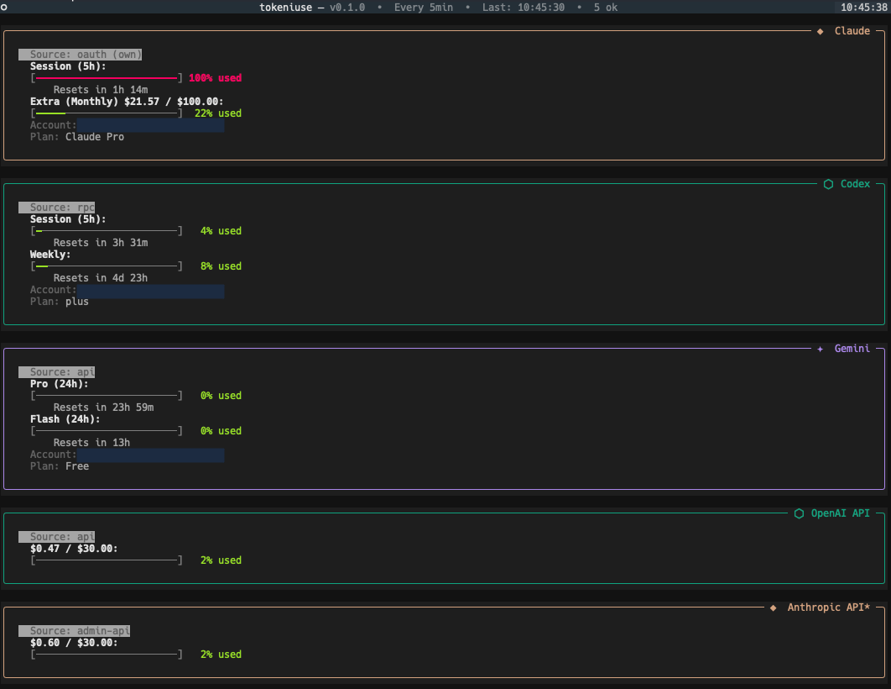

# llmeter

A terminal dashboard to monitor your AI coding assistant usage limits and API spend.

Built with [Textual](https://textual.textualize.io/) and [aiohttp](https://docs.aiohttp.org/). Provider logic reimplemented natively in Python from [CodexBar](https://github.com/steipete/CodexBar).

## Features

- **Multiple providers** — Codex, Claude, Gemini CLI quotas, OpenAI & Anthropic API billing
- **Self-contained OAuth** — One-time browser login for each provider, auto-refreshing tokens, no external CLIs needed
- **Config-driven** — JSON config controls which providers are shown and in what order
- **Live dashboard** — Color-coded usage bars with reset countdowns, auto-refreshing
- **One-shot mode** — Non-interactive Rich-formatted output for scripts and CI
- **Theme cycling** — 6 built-in themes (dark, light, monokai, dracula, nord, tokyo-night)



## Supported Providers

### CLI usage quotas

| Provider | ID | How it works | Auth |
|----------|----|-------------|------|
| **Codex** | `codex` | OAuth API (`chatgpt.com/backend-api/wham/usage`) | `llmeter --login-codex` |
| **Claude** | `claude` | OAuth API (`api.anthropic.com/api/oauth/usage`) | `llmeter --login-claude` |
| **Gemini** | `gemini` | Google Cloud Code quota API | `llmeter --login-gemini` |

### API billing

| Provider | ID | How it works | Auth |
|----------|----|-------------|------|
| **OpenAI API** | `openai-api` | `GET /v1/organization/costs` | Admin API key (`sk-admin-...`) |
| **Anthropic API** | `anthropic-api` | `GET /v1/organizations/cost_report` | Admin API key (`sk-ant-admin01-...`) |

## Prerequisites

- Python 3.11+
- **Codex**: Run `llmeter --login-codex` once
- **Claude**: Run `llmeter --login-claude` once
- **Gemini**: Run `llmeter --login-gemini` once
- **OpenAI API**: Admin API key from [platform.openai.com/settings/organization/admin-keys](https://platform.openai.com/settings/organization/admin-keys)
- **Anthropic API**: Admin API key from [console.anthropic.com](https://console.anthropic.com) (starts with `sk-ant-admin01-`)

No external CLI tools (codex, claude, gemini) are required. All OAuth flows are handled natively.

## Install

### Global install with uv (recommended)

```bash
uv tool install git+https://github.com/emmaneugene/llmeter
```

This installs `llmeter` into an isolated environment and makes the command available globally.

To upgrade later:
```bash
uv tool upgrade llmeter
```

### Global install with pip / pipx

Using [pipx](https://pipx.pypa.io/) (isolated environment, recommended over bare pip):
```bash
pipx install git+https://github.com/emmaneugene/llmeter
```

Or with plain pip:
```bash
pip install git+https://github.com/emmaneugene/llmeter
```

### Local development install

```bash
uv venv && uv pip install -e ".[dev]"
```

## Configuration

Config file: `~/.config/llmeter/settings.json`

Generate a default one:
```bash
llmeter --init-config
```

### Example with all providers

```json
{
  "providers": [
    { "id": "codex" },
    { "id": "claude" },
    { "id": "gemini" },
    { "id": "openai-api", "api_key": "sk-admin-...", "monthly_budget": 50.0 },
    { "id": "anthropic-api", "api_key": "sk-ant-admin01-...", "monthly_budget": 50.0 }
  ],
  "refresh_interval": 120
}
```

- **`providers`** — Providers to display, in order. Only listed providers are fetched.
- **`refresh_interval`** — Auto-refresh interval in seconds (default: 120).

Provider-specific settings:

| Setting | Applies to | Description |
|---------|-----------|-------------|
| `api_key` | `openai-api`, `anthropic-api` | Admin API key (overrides env var) |
| `monthly_budget` | `openai-api`, `anthropic-api` | Budget in USD — spend shown as a percentage bar |

### Credential storage

All OAuth credentials are stored in a single file:

```
~/.config/llmeter/auth.json
```

Each provider stores its tokens under a provider key (`anthropic`, `openai-codex`, `google-gemini-cli`). Tokens are auto-refreshed on each run. The file is created with `0600` permissions.

### Environment variables

API keys can also be set via environment variables:

| Variable | Provider |
|----------|----------|
| `OPENAI_ADMIN_KEY` | `openai-api` |
| `ANTHROPIC_ADMIN_KEY` | `anthropic-api` |

If no config file exists, only `codex` and `claude` are shown by default.

## Usage

### Interactive TUI

```bash
llmeter
```

### Snapshot mode

```bash
llmeter --snapshot
```

### Authentication

All three subscription providers support one-time OAuth login with automatic token refresh:

```bash
llmeter --login-codex    # OpenAI Codex (ChatGPT Plus/Pro)
llmeter --login-claude   # Anthropic Claude (Pro/Max)
llmeter --login-gemini   # Google Gemini (Cloud Code Assist)
```

This opens your browser, stores credentials in `~/.config/llmeter/auth.json`, and auto-refreshes tokens on each run. No need to re-authenticate unless you explicitly log out:

```bash
llmeter --logout-codex
llmeter --logout-claude
llmeter --logout-gemini
```

### All options

```
llmeter [options]

  --refresh SECONDS  Auto-refresh interval (overrides config)
  --snapshot         Print once and exit (Rich-formatted)
  --init-config      Create a default config file and exit
  --login-codex      Authenticate with Codex via OAuth (one-time setup)
  --logout-codex     Remove stored Codex OAuth credentials
  --login-claude     Authenticate with Claude via OAuth (one-time setup)
  --logout-claude    Remove stored Claude OAuth credentials
  --login-gemini     Authenticate with Gemini via Google OAuth (one-time setup)
  --logout-gemini    Remove stored Gemini OAuth credentials
  -V, --version      Show version
```

## Keybindings

| Key | Action |
|-----|--------|
| `r` | Refresh all providers |
| `t` | Cycle theme |
| `?` | Show help overlay |
| `q` | Quit |

## Testing

```bash
uv pip install -e ".[dev]"
pytest
```

57 tests covering credential CRUD, token refresh, usage endpoint calls, and response parsing for all three OAuth providers.

## Credits

- **[CodexBar](https://github.com/steipete/CodexBar)** — original inspiration
- **[pi-mono](https://github.com/badlogic/pi-mono)** — referenced for OAuth implementations

## Architecture

```
src/llmeter/
├── __main__.py              # CLI entry point
├── app.py                   # Textual app with auto-refresh
├── app.tcss                 # Textual CSS stylesheet
├── auth.py                  # Unified credential store (auth.json)
├── backend.py               # Provider orchestration
├── config.py                # JSON config loading
├── models.py                # Shared data models
├── providers/
│   ├── codex.py             # Codex: /wham/usage API
│   ├── codex_oauth.py       # Codex: PKCE OAuth login + token refresh
│   ├── claude.py            # Claude: OAuth usage + profile APIs
│   ├── claude_oauth.py      # Claude: PKCE OAuth login + token refresh
│   ├── gemini.py            # Gemini: Cloud Code quota API
│   ├── gemini_oauth.py      # Gemini: Google OAuth login + project discovery
│   ├── openai_api.py        # OpenAI: /v1/organization/costs
│   ├── anthropic_api.py     # Anthropic: /v1/organizations/cost_report
│   └── helpers.py           # Shared utilities (JWT decode, ISO8601, config dir)
├── widgets/
│   ├── provider_card.py     # Per-provider card UI
│   └── usage_bar.py         # Color-coded progress bar
└── tests/
    ├── test_auth.py         # Unified auth store tests
    ├── test_claude.py       # Claude credential + usage tests
    ├── test_codex.py        # Codex credential + usage tests
    └── test_gemini.py       # Gemini credential + usage tests
```
